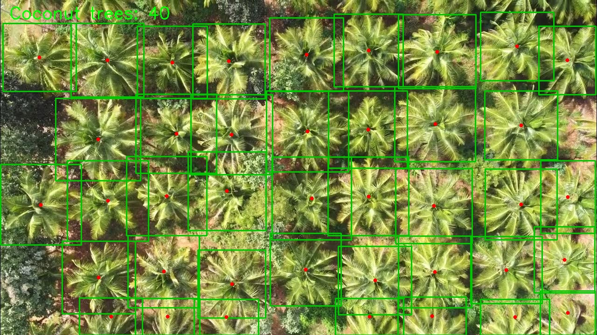
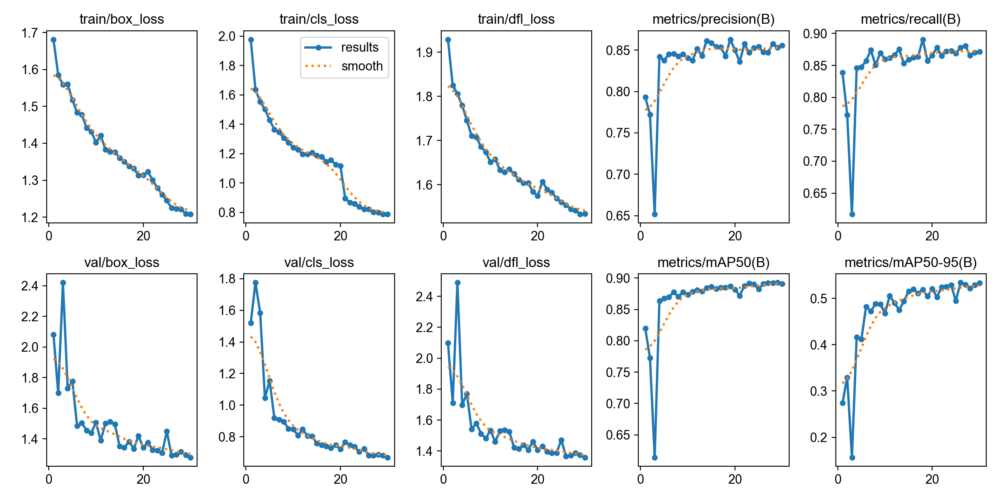
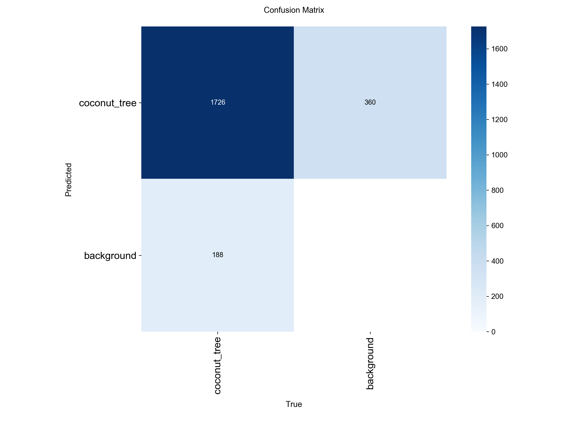
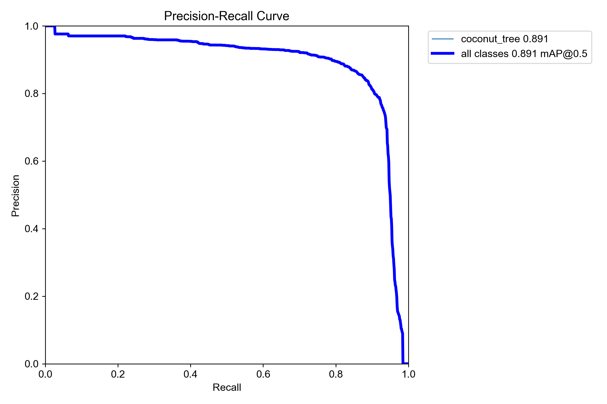
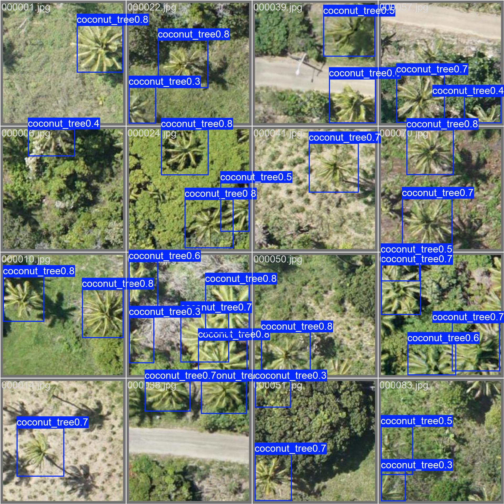

# Coconut Tree Canopy Analytics

An AI-assisted computer vision project for detecting, counting, and inspecting coconut tree crowns in drone imagery. The repository includes a trained YOLO detection model, command-line utilities, and a Flask web dashboard for interactive image analysis.



## What This Project Does

- Detects coconut tree crowns in aerial or drone images.
- Counts trees in single images, folders, and large orthomosaics using tiled inference.
- Exports detections to CSV with tree IDs, bounding boxes, centers, and confidence scores.
- Provides a browser dashboard with image upload, overlay controls, health labels, and CSV export.
- Includes optional YOLO segmentation and ByteTrack scripts for advanced image/video workflows.

## Current Model Status

The ready-to-run model in this repo is a YOLO detection model:

- Custom weights: `weights/best.pt`
- Base model family: YOLOv8 nano
- Classes: `coconut_tree`
- Latest completed run: `coconut_tree_detection-5`
- Validation metrics from the latest completed run:
  - Precision: 0.855
  - Recall: 0.871
  - mAP50: 0.891
  - mAP50-95: 0.533

The segmentation/tracking scripts are included, but the completed segmentation model is not currently packaged as the default runtime model. Use the detection workflow first unless you have trained segmentation weights.

## Repository Structure

```text
coco/
|-- assets/                    # Screenshots and training result images for README/docs
|-- config/
|   |-- config.yaml            # Detection training and inference settings
|   `-- config_seg.yaml        # Segmentation training and inference settings
|-- data/                      # Local datasets; large contents are ignored by Git
|-- docs/                      # Extra setup, dataset, and GitHub publishing notes
|-- outputs/                   # Generated predictions and CSV files; ignored by Git
|-- scripts/
|   |-- annotate_guide.py      # Labeling format reference
|   |-- count_farm.py          # Simple one-image counting entry point
|   |-- prepare_dataset.py     # Builds YOLO detection dataset splits
|   |-- convert_dataset_to_seg.py
|   |-- train.py               # Trains detection model
|   |-- train_seg.py           # Trains segmentation model
|   |-- predict_and_count.py   # Batch detection/counting CLI
|   |-- predict_seg_track.py   # Segmentation and ByteTrack workflow
|   |-- utils.py               # Shared config, path, dataset helpers
|   `-- web_app.py             # Flask dashboard
|-- weights/
|   `-- best.pt                # Custom trained detection model
|-- requirements.txt
|-- test_run.jpg               # Demo image
`-- README.md
```

## Quick Start

### 1. Create a Python environment

Windows PowerShell:

```powershell
python -m venv .venv
.\.venv\Scripts\Activate.ps1
```

macOS/Linux:

```bash
python -m venv .venv
source .venv/bin/activate
```

### 2. Install dependencies

```bash
pip install -r requirements.txt
```

### 3. Run the web dashboard

```bash
python scripts/web_app.py
```

Open:

```text
http://127.0.0.1:5000
```

Upload `test_run.jpg`, run diagnostics, inspect the overlay, and export the detection CSV.

## Command-Line Usage

Count trees in one image:

```bash
python scripts/count_farm.py test_run.jpg
```

Run batch detection on an image or folder:

```bash
python scripts/predict_and_count.py --source test_run.jpg --save
```

Use custom weights:

```bash
python scripts/predict_and_count.py --weights weights/best.pt --source path/to/image.jpg --save
```

Generated annotated images and CSV files are written to `outputs/`.

## Training Workflow

Expected YOLO detection dataset layout:

```text
data/raw/
|-- images/
|   |-- 000000.jpg
|   `-- ...
`-- annotations/
    |-- 000000.txt
    `-- ...
```

Each label file uses YOLO box format:

```text
class_id center_x center_y width height
```

Prepare the dataset:

```bash
python scripts/prepare_dataset.py
```

Train detection:

```bash
python scripts/train.py --epochs 100 --batch-size 16
```

Train on CPU if CUDA is unavailable:

```bash
python scripts/train.py --device cpu
```

## Segmentation and Tracking

To generate approximate segmentation labels from detection boxes:

```bash
python scripts/convert_dataset_to_seg.py --type octagon
```

Train segmentation:

```bash
python scripts/train_seg.py --epochs 100 --batch-size 16
```

Run segmentation/tracking on an image or video:

```bash
python scripts/predict_seg_track.py --weights path/to/segmentation/best.pt --source path/to/source.mp4 --save
```

Note: segmentation labels generated from boxes are approximations, not hand-drawn masks. For production segmentation quality, use real polygon annotations.

## Health Classification

The dashboard and segmentation scripts include a simple HSV color heuristic:

- Healthy: mostly green canopy pixels.
- Deficient: elevated yellow/brown canopy pixels.
- Diseased: high yellow/brown canopy pixel ratio.

This is a baseline visual heuristic, not a replacement for agronomic diagnosis or multispectral analysis.

## GitHub Notes

This repository is prepared to keep source code, documentation, demo assets, and the custom `weights/best.pt` model in Git while ignoring local datasets, generated outputs, virtual environments, and training runs.

Before pushing, review:

- `docs/GITHUB_PUSH_CHECKLIST.md`
- `docs/DATASET.md`
- `.gitignore`

Large local folders such as `data/`, `runs/`, `outputs/`, and `.venv/` should not be committed.

## Results Preview

Training curves:



Confusion matrix:



Precision-recall curve:



Validation predictions:



## Limitations

- The packaged model is trained for coconut tree crown detection, not general tree detection.
- Performance depends strongly on drone altitude, camera angle, image resolution, season, and plantation density.
- The default web app uses detection weights and polygon fallback overlays when real segmentation masks are unavailable.
- The HSV health classifier is only a baseline rule-based indicator.

## License

No license has been selected yet. Add a `LICENSE` file before publishing if you want others to know how they may use, modify, or distribute the project.
